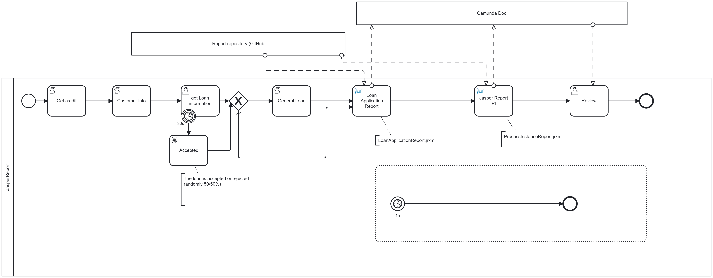

[](https://github.com/Camunda-Community-Hub/community/blob/main/extension-lifecycle.md#stable-)
[](https://github.com/camunda-community-hub/community)

# camunda-8-connector-jasper


# Jasper function

Execute a Jasper report.


A Jasper report is pass as input, using the FileStorage library


# Camunda document

## Use a Camunda document as input

Use the File Storage definition for a Camunda document
```json
{ 
  "storageDefinition": "CAMUNDA", 
  "content": jasperReport
}
```

Use a file from the server
```json
{ 
  "storageDefinition": "FOLDER:/usr/report", 
  "content": "LoanApplicationReport.jrxml"}
```
or
```json
{ 
  "storageDefinition": "FOLDER:C:/dev/intellij/community/connector/camunda-8-connector-jasper/src/test/resources", 
  "content": "LoanApplicationReport.jrxml"}
```

Use a file accessible from a URL
```json
{ 
  "storageDefinition": "URL", 
  "content": "https://github.com/camunda-community-hub/camunda-8-connector-jasper/raw/main/src/test/resources/ProcessInstanceReport.jrxml"
}
```

## Produce a Camunda document as output

Use for the `destinationJsonStorageDefinition`  
```json
{ "type": "CAMUNDA"}
```

Then in the output, use `LoanApplicationReport`

The Caunda reference is accessible under `LoanApplicationReport.camundaReference`

To connect it in a Widget Document Preview, use
```
[LoanApplicationReport.camundaReference]
````

# Data provided to Jasper

## Process instance variables

Connector does not allow Jasper to access all process variables, for security reason. Else, it will be simple to replace the Jasper report by another report and display all process variables.
Data available for Jasper are provided under the `data` parameter.
 For example

```json
{
  "customerInfo": customerInfo,
  "creditScore": creditScore,
  "loanInfo": loanInfo,
  "loanAccepted":loanAccepted,
  "loanAcceptanceComment": loanAcceptanceComment,
  "bankInfo": {"phoneNumber": "672 233 1323"}
}
```

In Jasper, variable can be accessible under `variables` by:

```
<expression>
  <![CDATA[ ($P{variables} != null && ((java.util.Map)$P{variables}).get("customerInfo") != null ? String.valueOf(((java.util.Map)((java.util.Map)$P{variables}).get("customerInfo")).get("customerName")) : "[Customer Name]") ]]>
</expression>
```

## process instance history

The process instance history can be avalable in the report under `history`.
It contains 


# process instance Context

The process instance history can be avalable in the report under `history`.
It contains the following information:

| Value                    | Description                                                         |
|--------------------------|---------------------------------------------------------------------|
| processInstanceKey       | The process instance (not the root, but the local process instance) |
| processInstanceRootKey   | The Root process instance, when used in a call activity             |
| processInstanceParentKey | The Parent process instance, when used in a call activity           |
| processStartDate         | process instance start time                                         | 
| tenantId                 | In a multi tenant server                                            |
| processDefinitionId      | The process Definition Id, as defined in the modeler                |
| processDefinitionVersion | Version as defined in the modeler                                   |
| processDefinitionName    | Process name, as defined in the modeler                             |
| processDefinitionKey     | The process Definition Key, created during deployment               |
| activityKey              | Activity key, created during execution                              |                                 
| activityName             | Activity Name as defined in the modeler                             |
| activityId               | Activity ID as defined in the modeler                               | 


### Inputs
| Name                             | Description              | Class             | Level    |
|----------------------------------|--------------------------|-------------------|----------|
| jasperReport                     | Jasper Report            | java.lang.Object  | REQUIRED |
| data                             | Data                     | java.lang.Object  | REQUIRED |
| formatExport                     | Format export            | java.lang.String  | REQUIRED |
| includeContext                   | Include context          | java.lang.Boolean | REQUIRED |
| includeProcessHistory            | Include history          | java.lang.Boolean | REQUIRED |
| destinationFileName              | Destination file name    | java.lang.String  | REQUIRED |
| destinationJsonStorageDefinition | JSon Storage Destination | java.util.Map     | REQUIRED |


### Outputs
| Name            | Description               | Class            | Level    |
|-----------------|---------------------------|------------------|----------|
| destinationFile | Destination variable name | java.lang.String | REQUIRED |


### Errors
| Name                              | Explanation                                                           |
|-----------------------------------|-----------------------------------------------------------------------|
| ERROR_EXECUTING_JASPER            | Error executing Jasper report                                         |
| LOAD_ERROR                        | An error occurs during the load                                       |
| NO_DESTINATION_STORAGE_DEFINITION | A destination storage must be provided (where do we store the result? |
| INCORRECTSTORAGEDEFINITION        | Definition to access the storage is incorrect                         |
| SAVE_ERROR                        | An error occurs during the save                                       |
| BAD_INPUTPARAMETER                | During the bind, some input does not have the expected type           |
| LOAD_DOCSOURCE                    | The reference can't be decoded                                        |

